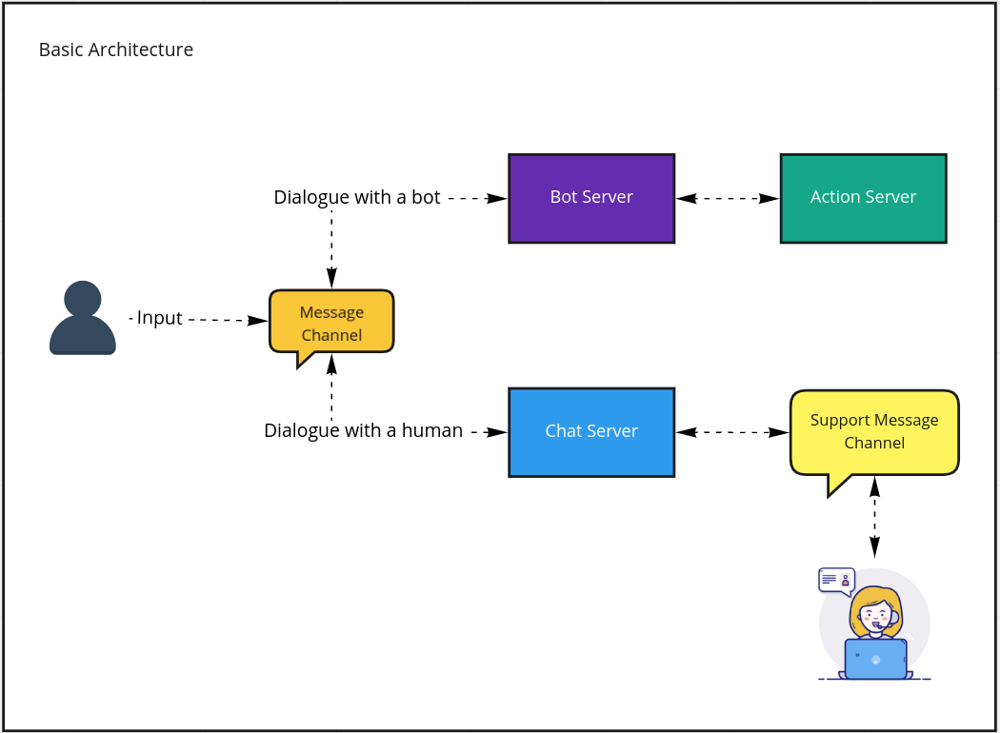
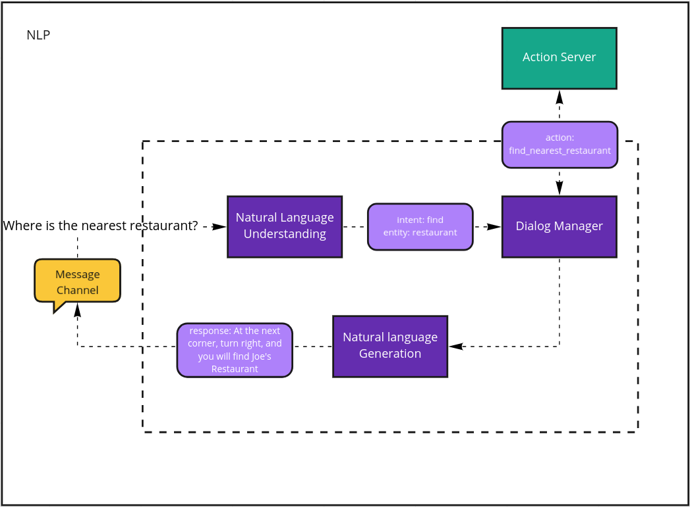
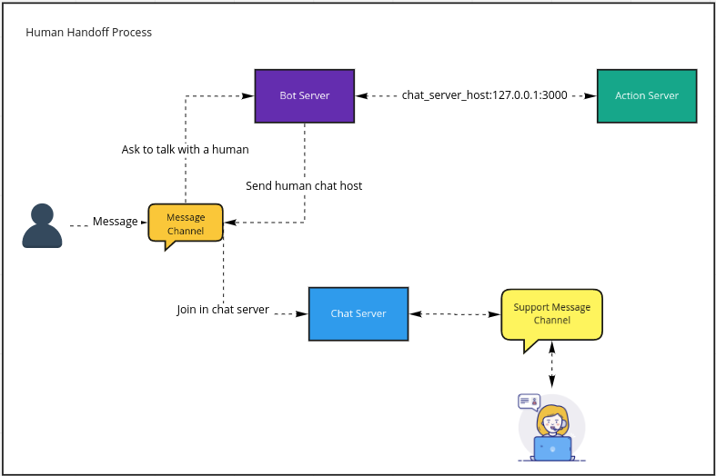

# Loan Bot

O Loan Bot trata-se de um assistente virtual para assuntos que envolvam crédito pessoal.

## Visão Geral

A propósta do bot é bem simples:

- Responponder perguntas frequentes (FAQ)
- Realizar uma simulação de crédito pessoal
- Transferir a conversa para um atendente

### FAQ

Até o presente momento, os assuntos abordados pelo bot são:

- O que são empréstimos/crédito pessoal
- Possibilidade de obter empréstimo sem crédito(nome sujo)
- Crédito não aprovado
- Como solicitar empréstimo
- Como solicitar análise de crédito
- Taxas/taxas especiais
- Adiantamento de parcelas
- Politica de garantias
- Empréstimo empresarial
- Parcelamento de empréstimo

## Tecnologias

- Bot Server: Python + Rasa Framework
- Action Server: Python + Rasa SDK
- Chat Server: Python + websockets package
- Message Channels: Javascript Vanilla

## Arquitetura

O projeto é composto pelos seguintes componentes: bot server, action server, chat server e message channels. O **bot server** é o responsável por entregar respostas automatizadas para o usuário, é ele quem faz a intepretação dos dados de entrada, define a ação a ser tomada e escolhe qual a melhor possível resposta para o requisitor.

Existem algumas situações em que o bot server precisa tratar os dados enviados para o usuário, como por exemplo a realização de um cálculo específico. Nesses casos é realizada uma chamada para o **action server** que firá responsável por executar uma rotina para o tratamento desses dados, que por fim serão retornados ao bot server.

O **chat server** consiste em um websocket responsável por conectar os usuários, clientes e suporte.

Os **message channels**, assim como o próprio nome remete, são canais pelos quais o usuário transmite suas mensages para o bot ou para um atendente e vice e versa.

No diagrama abaixo é possível ter uma visão geral da estruturação desses componentes:

### NLP

Basicamente, o NLP consiste em um processo de compreeder uma mensagem recebinda, essa vindo através de um formato entendível por humanos, processar os dados vindos através dessa mensagem e por fim retornar uma resposta adequada ao emissor.

Nesse projeto, o **Bot Server** fica responsável por realizar esse processamento, pois ele é composto pelos seguintes componentes:

#### NLU

**NLU**(Natural Language Understanding) que fica responsável por interpretar a mensagem do emissor, extraindo sua intenção e entidades.

#### Dialog Manager

O **Dialog Manager** utiliza como base as intenções e entidades extraídas pelo NLU para poder definir qual ação seguinte deve ser tomada. Em alguns casos, o DM pode indicar uma ação externa para que os dados, informados pelo emissor, possam ser tratados da forma adequada. Nessas situações o DM envia esse dados para um componente externo, nesse caso o **Action Server**, que faz o tratamento desses valores e os retornam para o DM, que pode continuar o seu fluxo.

#### NLG

**Natural Language Genaratio** é responsável por definir, com base na ação e os dados que ela provê, qual a melhor resposta para ser entregue ao solicitante.

Um diagrama com o fluxo do NLP pode ser visto abaixo:

#### Dados de treinamento

Para que um bot consiga compreender a mensagem que está sendo transmitida, faz-se necessário que uma grande massa de dados de exemplo seja passada para ele para que possa servir como base de treinamento.

Para o desenvolvimento desse projeto, foi utilizada a biblioteca ​ spaCy ​ , com o pacote
pt_core_news_sm ​ . Essa biblioteca contém modelos pré-treinados de palavras, nesse caso
do idioma português, o que facilita a extração de entidades, classificação de intenções,seleção de respostas, entre outras facilidades.

Além disso, foram utilizadas as ferramentas:

- (Leite)[https://github.com/idwall/leite], responsável por gerar dados brasileiros aleatórios.

- (Chatito)[https://rodrigopivi.github.io/Chatito/], auxilia na criação de datasets de NLU gerando frases reordenadas com base nos conjuntos de palavras expostos.

**ATENÇÃO**: Todos os dados utilizados para o treinamento desse assitente virutal são fictícios, e não devem ser utilizados em contextos reais.

### Chat Server + Message Channel

O **Chat Server** é responsável em conectar um usuário (cliente) a um suporte(assiste humano). Ele consiste basicamente em um websocket que separa os clientes em dois tipos "customer" e "supporter", onde customer é usuário cliente que interage diretamente com o bot, enquanto o outro faz o papél de um assistente humano.

O usuário (cliente) entra é conectado ao Chat Server somente após solicitar ao Bot Server para conversar com um humano. Nesse processo, o Bot Server solicita ao Action Server o endereço ao qual o Chat Server está hospedado, e envia para **Message Channel**, que por sua vez, altera o endereço e o protocolo para envio de mensagens para o alvo desejado.

